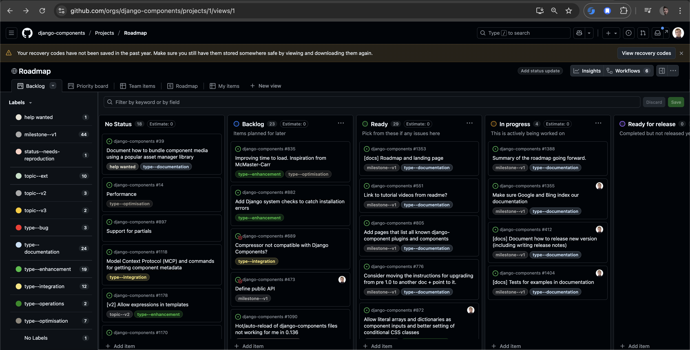
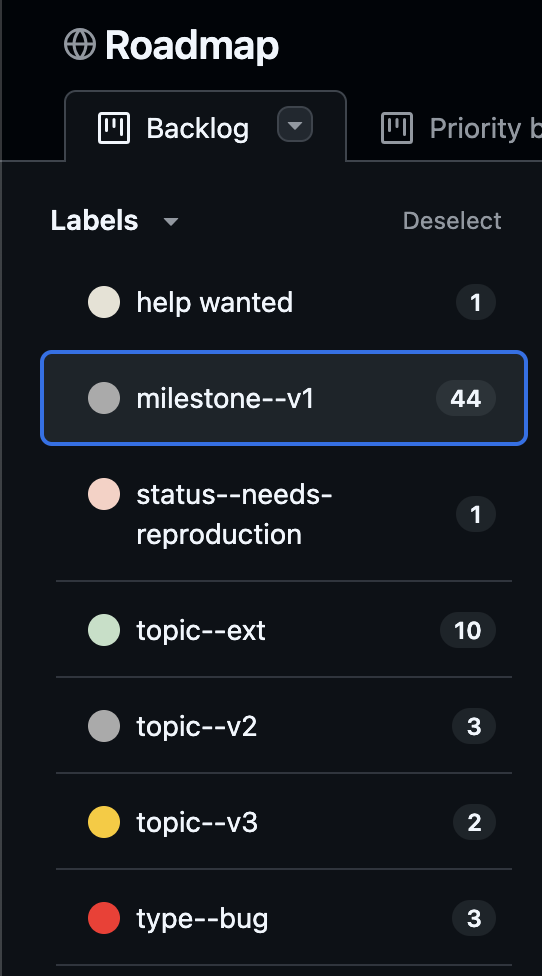

## Local installation

Start by forking the project by clicking the **Fork button** up in the right corner in the [GitHub](https://github.com/django-components/django-components).
This makes a copy of the repository in your own name. Now you can clone this repository locally and start adding features:

```sh
git clone https://github.com/<your GitHub username>/django-components.git
cd django-components
```

To quickly run the tests install the local dependencies by running:

```sh
pip install -r requirements-dev.txt
```

You also have to install this local django-components version. Use `-e` for [editable mode](https://setuptools.pypa.io/en/latest/userguide/development_mode.html) so you don't have to re-install after every change:

```sh
pip install -e .
```

## Running tests

Now you can run the tests to make sure everything works as expected:

```sh
pytest
```

The library is also tested across many versions of Python and Django. To run tests that way:

```sh
pyenv install -s 3.8
pyenv install -s 3.9
pyenv install -s 3.10
pyenv install -s 3.11
pyenv install -s 3.12
pyenv install -s 3.13
pyenv local 3.8 3.9 3.10 3.11 3.12 3.13
tox -p
```

To run tests for a specific Python version, use:

```sh
tox -e py38
```

NOTE: See the available environments in `tox.ini`.

## Linting and formatting

To check linting rules, run:

```sh
ruff check .
# Or to fix errors automatically:
ruff check --fix .
```

To format the code, run:

```sh
ruff format --check .
# Or to fix errors automatically:
ruff format .
```

To validate with Mypy, run:

```sh
mypy .
```

You can run these through `tox` as well:

```sh
tox -e mypy,ruff
```

## Playwright tests

We use [Playwright](https://playwright.dev/python/docs/intro) for end-to-end tests. You will need to install Playwright to run these tests.

Luckily, Playwright makes it very easy:

```sh
pip install -r requirements-dev.txt
playwright install chromium --with-deps
```

After Playwright is ready, run the tests the same way as before:

```sh
pytest
# Or for specific Python version
tox -e py38
```

## Dev server

How do you check that your changes to django-components project will work in an actual Django project?

Use the [sampleproject](https://github.com/django-components/django-components/tree/master/sampleproject/) demo project to validate the changes:

1. Navigate to [sampleproject](https://github.com/django-components/django-components/tree/master/sampleproject/) directory:

    ```sh
    cd sampleproject
    ```

2. Install dependencies from the [requirements.txt](https://github.com/django-components/django-components/blob/master/sampleproject/requirements.txt) file:

    ```sh
    pip install -r requirements.txt
    ```

3. Link to your local version of django-components:

    ```sh
    pip install -e ..
    ```

    !!! note

        The path to the local version (in this case `..`) must point to the directory that has the `pyproject.toml` file.

4. Start Django server:

    ```sh
    python manage.py runserver
    ```

Once the server is up, it should be available at <http://127.0.0.1:8000>.

To display individual components, add them to the `urls.py`, like in the case of <http://127.0.0.1:8000/greeting>

## Building JS code

django_components uses a bit of JS code to:

- Manage the loading of JS and CSS files used by the components
- Allow to pass data from Python to JS

When you make changes to this JS code, you also need to compile it:

1. Navigate to `src/django_components_js`:

    ```sh
    cd src/django_components_js
    ```

2. Install the JS dependencies

    ```sh
    npm install
    ```

3. Compile the JS/TS code:

    ```sh
    python build.py
    ```

    The script will combine all JS/TS code into a single `.js` file, minify it,
    and copy it to `django_components/static/django_components/django_components.min.js`.

## Packaging and publishing

To package the library into a distribution that can be published to PyPI, run:

```sh
# Install pypa/build
python -m pip install build --user
# Build a binary wheel and a source tarball
python -m build --sdist --wheel --outdir dist/ .
```

To publish the package to PyPI, use `twine` ([See Python user guide](https://packaging.python.org/en/latest/tutorials/packaging-projects/#uploading-the-distribution-archives)):

```sh
twine upload --repository pypi dist/* -u __token__ -p <PyPI_TOKEN>
```

[See the full workflow here.](https://github.com/django-components/django-components/discussions/557#discussioncomment-10179141)

## Documentation website

The documentation website is built using [MkDocs](https://www.mkdocs.org/) and [Material for MkDocs](https://squidfunk.github.io/mkdocs-material/).

First install dependencies needed for the documentation:

```sh
pip install -r requirements-docs.txt
```

Then install this local django-components version. Use `-e` for [editable mode](https://setuptools.pypa.io/en/latest/userguide/development_mode.html) so you don't have to re-install after every change:

```sh
pip install -e .
```

To run the documentation server locally, run:

```sh
mkdocs serve
```

Then open <http://127.0.0.1:9000/django-components/> in your browser.

To just build the documentation, run:

```sh
mkdocs build
```

The documentation site is deployed automatically with Github actions (see [`.github/workflows/docs.yml`](https://github.com/django-components/django-components/blob/master/.github/workflows/docs.yml)).

The CI workflow runs when:

- A new commit is pushed to the `master` branch - This updates the `dev` version
- A new tag is pushed - This updates the `latest` version and the version specified in the tag name

## Maintenance

### Updating supported versions

The `scripts/supported_versions.py` script can be used to update the supported versions.

```sh
python scripts/supported_versions.py
```

This will check the current versions of Django and Python, and will print to the terminal
all the places that need updating and what to set them to.

### Updating link references

The `scripts/validate_links.py` script can be used to update the link references.

```sh
python scripts/validate_links.py
```

When new version of Django is released, you can use the script to update the URLs pointing to the Django documentation.

First, you need to update the `URL_REWRITE_MAP` in the script to point to the new version of Django.

Then, you can run the script to update the URLs in the codebase.

```sh
python scripts/validate_links.py --rewrite
```

## Development guides

Head over to [Dev guides](./devguides/dependency_mgmt.md) for a deep dive into how django_components' features are implemented.

## Project management

### Project board

We use the [GitHub project board](https://github.com/orgs/django-components/projects/1/views/1) to manage the project.

Quick overview of the columns:

- *No status* - Issues that are not planned yet and need more discussion
- 🔵 **Backlog** - Planned but not ready to be picked up
- 🟢 **Ready** - Ready to be picked up
- 🟡 **In Progress** - Someone is already working on it
- 🟣 **Ready for release** - Completed, but not released yet
- 🟠 **Done** - Completed and released

New issues are automatically added to the *No status* column.

To pick up an issue, assign it to yourself and move it to the 🟡 **In Progress** column.



Use the sidebar to filter the issues by different labels, milestones, and issue types:

{ width="250" }

### Priority

Which issues should be picked up first?

We suggest the following guideline:

1. Bugs - First fix [bugs](https://github.com/orgs/django-components/projects/1/views/1?sliceBy%5Bvalue%5D=type--bug) and documentation errors.
2. V1 release - Then pick up issues that are part of the [v1 release milestone](https://github.com/orgs/django-components/projects/1/views/1?sliceBy%5Bvalue%5D=milestone--v1).

After that, pick what you like!

### Labels

Labels help keep our project organized. [See the list of all labels here](https://github.com/django-components/django-components/labels).

#### Milestones

- [`milestone--v1`](https://github.com/orgs/django-components/projects/1/views/1?sliceBy%5Bvalue%5D=milestone--v1) - Work to be done for the V1 release.

#### Issue types

- [`type--bug`](https://github.com/orgs/django-components/projects/1/views/1?sliceBy%5Bvalue%5D=type--bug) - Bugs.
- [`type--documentation`](https://github.com/orgs/django-components/projects/1/views/1?sliceBy%5Bvalue%5D=type--documentation) - Documentation changes.
- [`type--enhancement`](https://github.com/orgs/django-components/projects/1/views/1?sliceBy%5Bvalue%5D=type--enhancement) - New features and improvements.
- [`type--integration`](https://github.com/orgs/django-components/projects/1/views/1?sliceBy%5Bvalue%5D=type--integration) - Integrating with other libraries or systems.
- [`type--operations`](https://github.com/orgs/django-components/projects/1/views/1?sliceBy%5Bvalue%5D=type--operations) - Relating to "operations" - Github Actions, processes, etc.
- [`type--optimisation`](https://github.com/orgs/django-components/projects/1/views/1?sliceBy%5Bvalue%5D=type--optimisation) - Optimizing the code for performance.
