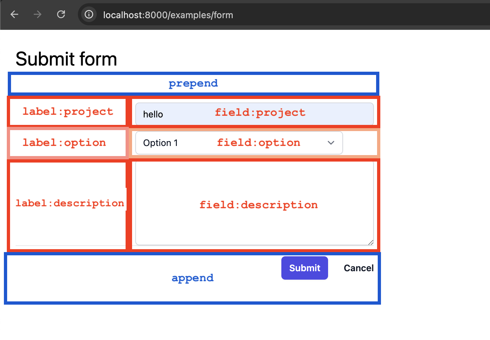

# Form

A `Form` component that automatically generates labels and arranges fields in a grid. It simplifies form creation by handling the layout for you.


To get started, use the following example to create a simple form with 2 fields - `project` and `option`:

```django

  
    <input name="project" required>
  

  
    <select name="option" required>
      <option value="1">Option 1</option>
      <option value="2">Option 2</option>
      <option value="3">Option 3</option>
    </select>
  

```

This will render a `<form>` where fields are defined using `field:<field_name>` slots.

Labels are automatically generated from the field name. If you want to define a custom label for a field,
you can use the `label:<field_name>` slot.

```django

  {# Custom label for "description" field #}
  
    
  

  
    <textarea name="description" required></textarea>
  

```

Whether you define custom labels or not, the form will have the following structure:



## API

### `Form` component

The `Form` component is the main container for your form fields. It accepts the following arguments:

- **`editable`** (optional, default `True`): A boolean that determines if the form is editable.
- **`method`** (optional, default `"post"`): The HTTP method for the form submission.
- **`form_content_attrs`** (optional): A dictionary of HTML attributes to be added to the form's content container.
- **`attrs`** (optional): A dictionary of HTML attributes to be added to the `<form>` element itself.

To define the fields, you define a slot for each field.

**Slots:**

- **`field:<field_name>`**: Use this slot to define a form field. The component will automatically generate a label for it based on `<field_name>`.
- **`label:<field_name>`**: If you need a custom label for a field, you can define it using this slot.
- **`prepend`**: Content in this slot will be placed at the beginning of the form, before the main fields.
- **`append`**: Content in this slot will be placed at the end of the form, after the main fields. This is a good place for submit buttons.

### `FormLabel` component

When `Form` component automatically generates labels for fields, it uses the `FormLabel` component.

When you need a custom label for a field, you can use the `FormLabel` component explicitly in `label:<field_name>` slots.

The `FormLabel` component accepts the following arguments:

- **`field_name`** (required): The name of the field that this label is for. This will be used as the `for` attribute of the label.
- **`title`** (optional): Custom text for the label. If not provided, the component will automatically generate a title from the `field_name` by replacing underscores and hyphens with spaces and applying title case.

**Example:**

```django

```

This will render:

```html
<label for="user_name" class="font-semibold text-gray-700">
  Your Name
</label>
```

If `title` is not provided, `field_name="user_name"` would automatically generate the title "User Name",
converting snake_case to "Title Case".

## Example

To see the component in action, you can set up a view and a URL pattern as shown below.

### `views.py`

```djc_py
--8<-- "sampleproject/examples/pages/form.py"
```

### `urls.py`

```python
from django.urls import path

from examples.pages.form import FormPage

urlpatterns = [
    path("examples/form", FormPage.as_view(), name="form"),
]
```

## Definition

### `form.py`

```djc_py
--8<-- "sampleproject/examples/components/form/form.py"
```

### `form.html`

```django

--8<-- "sampleproject/examples/components/form/form.html"
```
