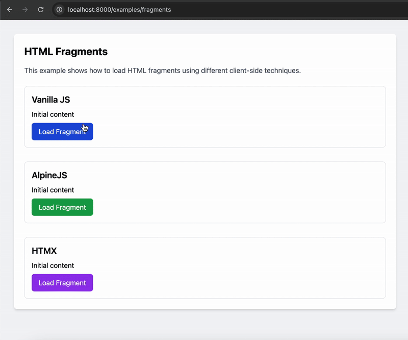

# HTML fragments

Fragments are pieces of HTML that are inserted into the page without a full page reload.
Fragments are also known as partials or HTML-over-the-wire.

The usual flow is to:

1. Make a server request
2. Server responds with new HTML
3. Insert the new HTML into the page

This example loads HTML fragments using different client-side techniques: vanilla JavaScript, AlpineJS, and HTMX.

In each of the 3 cases, when the fragment is loaded, this also runs the fragment's JS and CSS code.



## Definition

```djc_py
--8<-- "docs/examples/fragments/component.py"
```

## Example

To see the component in action, you can set up a view and a URL pattern as shown below.

### `views.py`

```djc_py
--8<-- "docs/examples/fragments/page.py"
```

### `urls.py`

```python
from django.urls import path

from examples.pages.fragments import FragmentsPage

urlpatterns = [
    path("examples/fragments", FragmentsPage.as_view(), name="fragments"),
]
```
