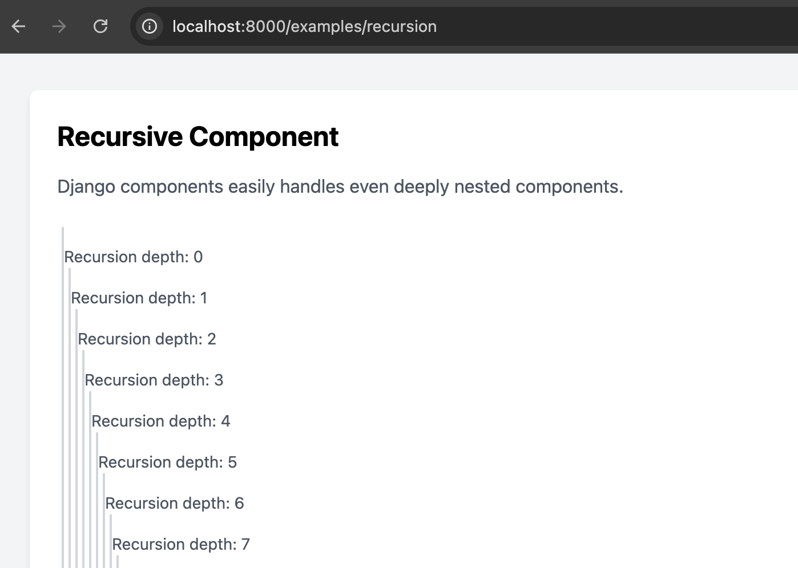

# Recursion

Unlike other frameworks, `django-components` handles templates of any depth. 100 nested components? Not a problem!

In this example, the `Recursion` will recursively render itself 100 times.

```django

```

This will produce a deeply nested structure of divs, with each level indicating its depth in the recursion.



## Definition

```djc_py
--8<-- "docs/examples/recursion/component.py"
```

## Example

To see the component in action, you can set up a view and a URL pattern as shown below.

### `views.py`

```djc_py
--8<-- "docs/examples/recursion/page.py"
```

### `urls.py`

```python
from django.urls import path

from examples.pages.recursion import RecursionPage

urlpatterns = [
    path("examples/recursion", RecursionPage.as_view(), name="recursion"),
]
```
