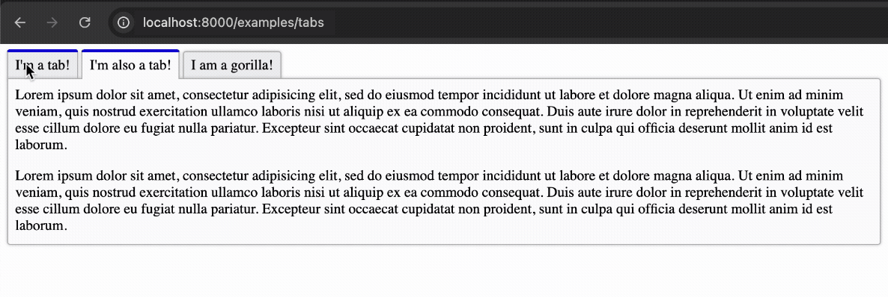

# Tabs (AlpineJS)

_(By [@JuroOravec](https://github.com/JuroOravec) and [@mscheper](https://github.com/mscheper))_

This example defines a tabs component. Tabs are dynamic - to change the currently
opened tab, click on the tab headers.

To get started, use the following example to create a simple container with 2 tabs:

```django

    
        This is the content of Tab 1
    
    
        This is the content of Tab 2
    

```



## API

The tab component is composed of two parts: `Tablist` and `Tab`. Here's how you can customize them.

### `Tablist` component

The `Tablist` component is the main container for the tabs. It accepts the following arguments:

- **`id`** (optional): A unique ID for the tab list. If not provided, it's generated from the `name`.
- **`name`**: The name of the tab list, used as a WAI-ARIA label for accessibility.
- **`selected_tab`** (optional): The `id` of the tab that should be selected by default.
- **`container_attrs`**, **`tablist_attrs`**, **`tab_attrs`**, **`tabpanel_attrs`** (optional): Dictionaries of HTML attributes to be added to the corresponding elements.

Inside the `Tablist`'s default slot you will define the individual tabs.

### `Tab` component

The `Tab` component defines an individual tab. It MUST be nested inside a `Tablist`. It accepts the following arguments:

- **`header`**: The text to be displayed in the tab's header.
- **`disabled`** (optional): A boolean that disables the tab if `True`.
- **`id`** (optional): A unique ID for the tab. If not provided, it's generated from the header.

Use the `Tab`'s default slot to define the content of the tab.

## Example

To see the component in action, you can set up a view and a URL pattern as shown below.

### `views.py`

This example shows how to render a full page with the tab component.

```djc_py
--8<-- "sampleproject/examples/pages/tabs.py"
```

### `urls.py`

```python
from django.urls import path

from examples.pages.tabs import TabsPage

urlpatterns = [
    path("examples/tabs", TabsPage.as_view(), name="tabs"),
]
```

## How it works

At the start of rendering, `Tablist` defines special context that `Tab`s recognize.

When a `Tab` component is nested and rendered inside a `Tablist`, it registers itself with the parent `Tablist` component.

After the rendering of `Tablist`'s body is done, we end up with list of rendered `Tabs` that were encountered.

`Tablist` then uses this information to dynamically render the tab HTML.

## Definition

### `tabs.py`

```djc_py
--8<-- "sampleproject/examples/components/tabs/tabs.py"
```

### `tabs.html`

```django
--8<-- "sampleproject/examples/components/tabs/tabs.html"
```

### `tabs.css`

```css
--8<-- "sampleproject/examples/components/tabs/tabs.css"
```
